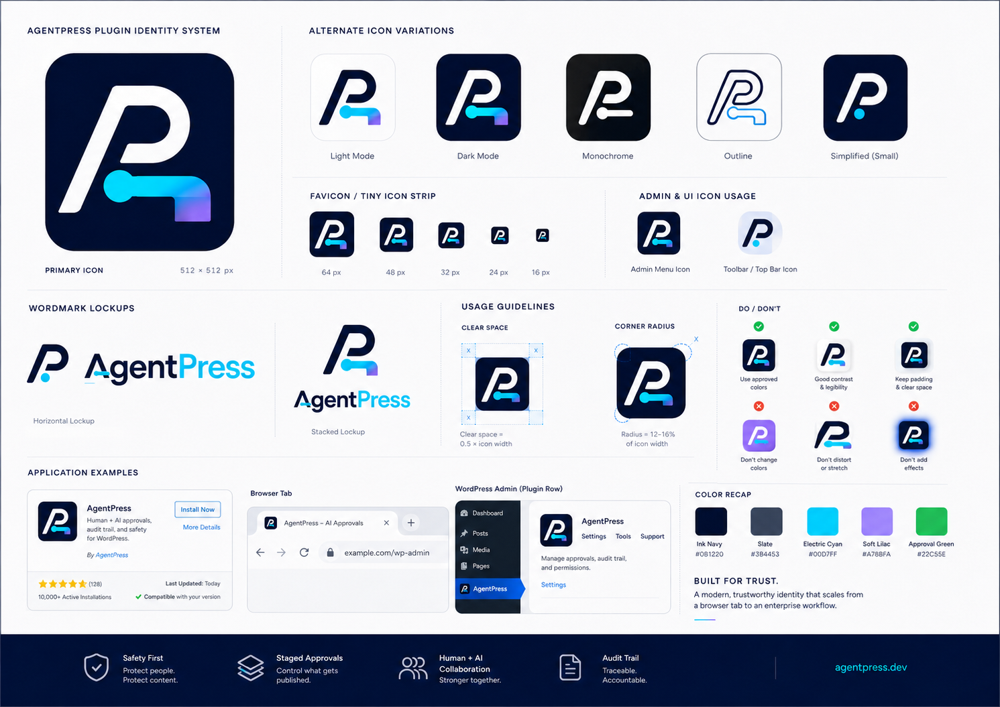

# AgentPress

**The shared human-agent workspace for WordPress.**

<p align="center">
  <a href="https://agentpress-webmcp.bigleg.chatgpt.site/">
    
  </a>
</p>

<p align="center">
  <a href="https://agentpress-webmcp.bigleg.chatgpt.site/"><strong>View the interactive AgentPress concept →</strong></a>
</p>

AgentPress is an open-source WordPress plugin project that will let ChatGPT work inside the WordPress session a human is already using. WordPress defines the user's maximum authority. AgentPress narrows that authority into actions the agent may perform automatically, actions requiring explicit human approval, and actions that remain unavailable.

> **Project stage:** early implementation. The scaffold, attributed bridge boundary, browser adapter, private transport, versioned persistence, policy layer, fixed 15-Ability catalog, and sanitized execution audit are implemented. Ability services, product UI, release, and live challenge workflow remain unimplemented or unverified.

## Product thesis

```text
ChatGPT Site Tools
        ↓
WebMCP adapter using the signed-in browser session
        ↓
AgentPress policy, Change Sets, approvals, and audit
        ↓
WordPress Abilities API
        ↓
WordPress capabilities and application logic
```

The canonical v0.1 experiment is to inspect a site, create content drafts, assign existing taxonomy, stage a navigation change, approve it visibly in WordPress, and prove that a restricted Author account cannot exceed its permissions.

## We are building this as a reproducible experiment

The repository is both the product source and the lab notebook for the WebMCP Challenge. Every material research or implementation session should leave enough evidence for another person to answer:

1. What question were we testing?
2. What did we expect to be true?
3. What was held constant?
4. What did we change or inspect?
5. What did we directly observe?
6. Which claims came from primary sources?
7. What failed or contradicted the hypothesis?
8. What decision followed, and what remains untested?
9. Which files, commands, commits, screenshots, or recordings prove the result?
10. Can another person repeat the test?

This is intentionally closer to a science experiment than a conventional progress diary.

### Evidence labels

Every evidence record uses these labels so that design intent is never confused with a working result:

| Label | Meaning |
|---|---|
| `OBSERVED` | Directly seen in the repository, command output, browser, database, or UI during the recorded session. |
| `SOURCE_VERIFIED` | Supported by a linked primary source or inspected upstream source code. |
| `INFERRED` | A reasoned conclusion from observations; not directly demonstrated. |
| `DECIDED` | A project choice made after considering the evidence. |
| `PROPOSED` | Planned work that has not been built or accepted. |
| `NOT_TESTED` | Explicit boundary where no current verification exists. |

An agent must not upgrade `PROPOSED` or `NOT_TESTED` to `OBSERVED` without running the relevant test.

### Experiment lifecycle

```text
Question
  -> hypothesis and falsification condition
  -> baseline commit/worktree capture
  -> controls and variables
  -> primary-source and repository inspection
  -> implementation or test
  -> observation ledger
  -> result: supported / falsified / inconclusive
  -> artifacts and hashes
  -> next experiment
```

The root [AGENTS.md](AGENTS.md) makes this protocol mandatory for coding agents. The [evidence index](docs/EVIDENCE_INDEX.md) is the append-only registry, and the [experiment template](docs/evidence/EXPERIMENT_TEMPLATE.md) is the standard session format.

## Experiment 001 — research to implementation-ready specification

On 30 August 2026, we treated the AgentPress PRD as a hypothesis rather than assuming it was technically build-ready.

### Research question

Can AgentPress v0.1 be reduced to a small, permission-safe architecture that uses current WordPress Abilities and WebMCP behavior, fits the challenge constraints, and gives an engineering agent an unambiguous build order?

### Initial hypothesis

The PRD's product direction was sound, and the existing open-source WordPress/WebMCP bridge could supply most generic transport plumbing, but the Ability catalog, approval storage, and bridge integration needed source-level validation before scaffolding.

### Controls

- Baseline repository commit: `835a8d241519544053a8c90b9047c665727b92bf`.
- Product scope and non-goals remained fixed by PRD v2.
- Primary target remained WordPress 6.9+, PHP 8.0+, HTTPS, and ChatGPT desktop Site Tools.
- No plugin code, GitHub issues, commit, deployment, or live browser workflow was created during the session.
- Claims were checked against the supplied primary reference set; community sources were not treated as normative contracts.

### Method

1. Read the 2,036-line PRD, README, security policy, contribution guidance, license, worktree state, and recent history.
2. Split research into three read-only tracks:
   - local PRD/repository requirements and contradictions;
   - current WordPress Abilities and MCP Adapter contracts;
   - current WebMCP, ChatGPT Site Tools, challenge rules, and bridge source.
3. Inspect the current primary documentation and upstream implementation instead of relying on product summaries.
4. Record only contradictions that would change code, security, packaging, or the demo.
5. Resolve those contradictions in an implementation specification before producing tasks.
6. Derive an issue-ready build checklist from the resolved architecture.
7. Run structural checks on tool/task counts, names, Markdown fences, local links, and the final worktree.

### Main observations and decisions

- `OBSERVED`: PRD v2 named 17 tools while imposing a maximum of 15.
- `DECIDED`: combine the three bootstrap reads into `agentpress/get-context`, leaving 15 distinct Ability contracts.
- `SOURCE_VERIFIED`: current WebMCP uses `document.modelContext.registerTool`; the audited upstream bridge used an obsolete registration path.
- `SOURCE_VERIFIED`: WordPress REST cookie identity requires a valid `wp_rest` nonce; the audited upstream bridge's read/write nonce behavior was not suitable for AgentPress.
- `DECIDED`: ship one AgentPress-owned, same-origin adapter derived from selected GPL-compatible upstream patterns rather than install the upstream plugin unchanged.
- `OBSERVED`: the PRD's approval tables could not represent immutable proposals, stale-target checks, expiry, approvers, or idempotency.
- `DECIDED`: retain three tables but add the hashes, states, actors, timestamps, and indexes required to enforce those invariants.
- `DECIDED`: support classic menus on the challenge fixture and fail clearly for block Navigation in v0.1.
- `OBSERVED`: the resulting specification contains 15 unique Ability contracts and 15 unique WebMCP names.
- `OBSERVED`: the build checklist contains 36 bounded tasks; every task has dependencies and an acceptance test.
- `NOT_TESTED`: no WordPress runtime, ChatGPT Site Tools discovery, permission matrix, approval flow, or 5/5 demo run exists yet.

The complete method, sources, observations, falsification conditions, artifact hashes, and limitations are preserved in [Experiment 001](docs/evidence/sessions/2026-08-30-exp-001-research-to-spec.md).

## Approved visual direction and concepts

The project owner identified the following identity sheet as the approved visual direction and later added a standalone gradient wordmark to the approved collection. These are visual/design evidence only; they do not prove the depicted plugin screens or `agentpress.dev` examples exist.



The standalone approved wordmark is linked through the asset ledger rather than repeated here. Four additional sheets are preserved as concepts and references. They are useful for future interface and submission design, but they are not final product contracts. In particular, the concept icon library contains older Ability/status ideas that must not override the implementation specification.

See the [visual asset ledger](docs/evidence/assets/README.md) for classification, original filenames, hashes, provenance limits, and permitted use. The move/classification session is recorded as [Experiment 003](docs/evidence/sessions/2026-08-30-exp-003-visual-assets.md).

## Current evidence-backed status

| Area | Status | Evidence |
|---|---|---|
| Product scope | `OBSERVED` | [PRD v2](docs/PRD.md) |
| Technical architecture | `DECIDED`, scaffold and provenance implemented | [Implementation specification](docs/IMPLEMENTATION_SPEC.md) |
| Engineering sequence | `PROPOSED`, acceptance tests defined | [Build checklist](docs/BUILD_CHECKLIST.md) |
| WordPress plugin scaffold | `OBSERVED`, merged in PR #2 | [Experiment 005](docs/evidence/sessions/2026-08-30-exp-005-plugin-scaffold.md) |
| Bridge source provenance | `OBSERVED`, merged in PR #4 | [Experiment 008](docs/evidence/sessions/2026-08-30-exp-008-bridge-pin-attribution.md) |
| Current WebMCP browser adapter | `OBSERVED`, merged in PR #6 | [Experiment 009](docs/evidence/sessions/2026-08-30-exp-009-current-webmcp-adapter.md) |
| Private WordPress-session transport | `OBSERVED`, PR #8; local runtime and hosted repository gates pass | [Experiment 010](docs/evidence/sessions/2026-08-30-exp-010-private-rest-transport.md) |
| Versioned database and repositories | `OBSERVED`, PR #10; local runtime and hosted repository gates pass | [Experiment 011](docs/evidence/sessions/2026-08-31-exp-011-database-repositories.md) |
| Common schemas and error normalization | `OBSERVED`, merged in PR #12; local WordPress/error/transport and hosted repository gates pass | [Experiment 012](docs/evidence/sessions/2026-08-31-exp-012-common-schemas-errors.md) |
| Safe Mode and capability-aware discovery | `OBSERVED`, merged in PR #14; local role/capability/object/R3 matrices and hosted repository gates pass | [Experiment 013](docs/evidence/sessions/2026-08-31-exp-013-safe-mode-discovery-policy.md) |
| Fixed WordPress Ability catalog | `OBSERVED`, merged in PR #16; local exact-contract/native-REST/bridge-role matrices and hosted repository gates pass | [Experiment 014](docs/evidence/sessions/2026-08-31-exp-014-ability-registry.md) |
| Sanitized execution audit | `OBSERVED`, merged in PR #18; local secret/size/outcome/unauthenticated matrices and hosted repository gates pass | [Experiment 015](docs/evidence/sessions/2026-08-31-exp-015-sanitized-audit-logging.md) |
| Change Set coordinator and idempotency | `OBSERVED`, merged in PR #20; local coordinator/state/hash/runtime and hosted repository gates pass | [Experiment 016](docs/evidence/sessions/2026-08-31-exp-016-change-set-coordinator.md) |
| Safe bootstrap context | `OBSERVED`, merged in PR #22; local role/schema/privacy and hosted repository gates pass | [Experiment 017](docs/evidence/sessions/2026-08-31-exp-017-get-context.md) |
| Bounded visible site structure | `OBSERVED`, merged in PR #24; local role/hierarchy/count/schema/privacy and hosted repository gates pass | [Experiment 018](docs/evidence/sessions/2026-09-01-exp-018-site-structure.md) |
| Bounded content reads | `OBSERVED`, local role/object/filter/pagination/schema/privacy and package gates pass; hosted repository gates pending | [Experiment 019](docs/evidence/sessions/2026-09-01-exp-019-content-reads.md) |
| ChatGPT Site Tools integration | `NOT_TESTED` | AP-028 acceptance gate |
| Canonical workflow reliability | `NOT_TESTED` | AP-031 requires five consecutive passes |
| Challenge submission | `NOT_TESTED` | AP-032 defines the submission evidence gate |

## Next experiment

The next dependency-ordered implementation experiment is `AP-014 — Implement list-terms`. AP-001 through AP-012 are merged; AP-013 passes its local role, object, filter, pagination, schema, privacy, regression, and package gates, with commit/PR hosted verification pending.

**Hypothesis:** one fixed category/tag read service can return deterministic visible term search and pagination results to authenticated readers while rejecting custom taxonomies and changing no term state.

**Falsification condition:** category/tag fixtures differ from output; search or pagination is unstable; a custom taxonomy succeeds; a restricted reader receives fields outside the fixed schema; or any term/object state changes.

**Prerequisite evidence:** AP-008 is merged, and Experiment 014 records the exact registered schema and policy-filtered discovery matrix. Experiment 019 records the permission-filtered deterministic read pattern and local gates for the preceding content readers.

The detailed task and acceptance test are in the [build checklist](docs/BUILD_CHECKLIST.md#ap-014--implement-list-terms).

## Local development

Prerequisites are Node.js 20+, Docker Desktop, and Git. Host PHP and Composer are optional because `wp-env` supplies them inside the CLI container.

```powershell
npm install
npm run env:start
npm run env:activate
npm run test:unit
npm run lint:php
npm run build:zip
```

The supported environment is WordPress 6.9 on PHP 8.0. Separate `.wp-env.wp68.json` and `.wp-env.php74.json` configurations preserve the two fail-closed controls. The generated ZIP is written to `dist/agentpress.zip`; it is intentionally ignored by Git and must not be treated as release evidence until AP-030.

## Product principles

- Use the logged-in WordPress identity—no copied API keys or application passwords.
- Build capabilities on the WordPress Abilities API so core behavior remains protocol-independent.
- Allow safe, reversible work such as reading and creating drafts.
- Stage consequential changes such as publishing and navigation edits for approval in wp-admin.
- Revalidate authorization server-side for every execution.
- Keep a visible, sanitized audit trail of agent activity.
- Never expose sensitive administration, arbitrary code execution, credentials, or privilege escalation.
- Prefer a smaller workflow that passes 5/5 over broader unverified compatibility.

## Documentation

- [Product requirements](docs/PRD.md)
- [Implementation specification](docs/IMPLEMENTATION_SPEC.md)
- [Dependency-ordered build checklist](docs/BUILD_CHECKLIST.md)
- [Evidence index](docs/EVIDENCE_INDEX.md)
- [Experiment template](docs/evidence/EXPERIMENT_TEMPLATE.md)
- [Visual asset ledger](docs/evidence/assets/README.md)
- [Agent working agreement](AGENTS.md)
- [Contributing](CONTRIBUTING.md)
- [Security policy](SECURITY.md)
- [Code of Conduct](CODE_OF_CONDUCT.md)

## Contributing

Discussion and focused contributions are welcome. Read [CONTRIBUTING.md](CONTRIBUTING.md) before proposing implementation changes. Material work must add or update an evidence record. Security issues should be reported privately as described in [SECURITY.md](SECURITY.md).

## License

AgentPress is licensed under the [GNU General Public License v2.0 or later](LICENSE).
